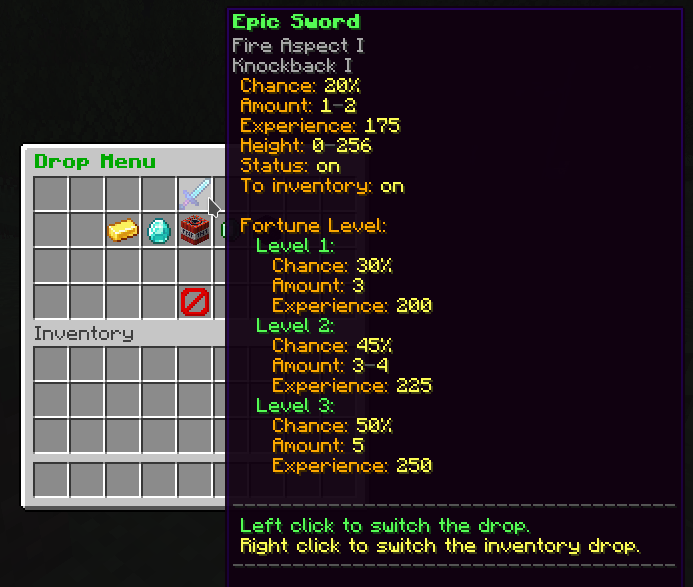

# LovelyDrop

LovelyDrop is a minecraft plugin that adds a drop system to a server. You can customize what items should be dropped by specifying various properties. Besides, the whole drop menu is also configurable, you can add items that should perform specific actions when clicked, and you can name them as you want.

## Features
- The fully customizable GUI with items that can perform few actions when clicked
  - Set title and rows for menu
  - Set optional filler type and display name for it
  - Set display name and lore for menu item with 5 available placeholders
    - **{CHANCE}** - a chance of the item to drop
    - **{AMOUNT}** - a formatted amount of the item that could drop
    - **{EXPERIENCE}** - an experience that will be given to the player
    - **{SWITCH}** - text that will be shown depending on the drop switch status
    - **{SWITCH_INVENTORY}** - text that will be shown depending on the inventory drop switch status
  - Set action that item should perform after being clicked
    - **NONE** - item will not do any action
    - **CLOSE_MENU** - menu will be closed
    - **SWITCH_DROP** - drop assigned to this menu item will be turned on/off
    - **SWITCH_DROP_TO_INVENTORY** - drop assigned to this menu item will have its "drop to inventory" property switched
  - Set click types when to perform the specified action
    - **ALL** - action will be performed on any type of the click
    - **LEFT** - action will be performed on left click
    - **RIGHT** - action will be performed on right click
    - Whole list of click types is [here](https://hub.spigotmc.org/javadocs/bukkit/org/bukkit/event/inventory/ClickType.html)!
- The configurable drop section
  - Adding as many items as you want
  - Set **display name and lore** of the dropped item (optional)
  - Set **chance** of the drop
  - Set **experience** that should be given to the player
  - Set **amount** of possible items of the drop
  - Set **enchantments** of the drop
## Configuration
The whole configuration of the plugin is explained in this
[default configuration file](https://github.com/zrdzn/LovelyDrop/blob/master/plugin/src/main/resources/config.yml).
## Commands and permissions
| Command | Permission | Description                                                                                 |
| ----------------|---------------|----------------------------------------------------------------------------------|
| /drop | lovelydrop.menu.open | a main command - shows the drop menu                                                  |
| /ldp reload | lovelydrop.reload | reloads the whole plugin including configuration                                 |

## Requirements
The plugin runs on the spigot servers and its forks. Minecraft versions above **1.8 up to 1.18.2** are fully supported by the plugin.

## How to download
1. Read the [requirements](#requirements)
2. Download .jar from the [releases](https://github.com/zrdzn/LovelyDrop/releases) tab
3. Place .jar in the `plugins` directory
4. Start your server
5. Configure the plugin if you want
